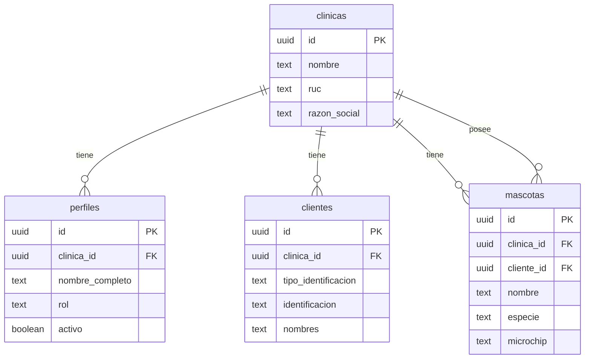

# Modelo de datos

Diagrama entidad-relacion de la veersion incial.

```mermaid
erDiagram
	clinicas ||--o{ perfiles : tiene
	clinicas ||--o{ clientes : tiene
	clinicas ||--o{ mascotas : tiene
	clinicas ||--o{ mascotas : posee

	clinicas {
		uuid id PK
		text nombre
		text ruc
		text razon_social
	}
	perfiles {
		uuid id PK
		uuid clinica_id FK
		text nombre_completo
		text rol
		boolean activo
	}
	clientes {
		uuid id PK
		uuid clinica_id FK
		text tipo_identificacion
		text identificacion
		text nombres
	}
	mascotas {
		uuid id PK
		uuid clinica_id FK
		uuid cliente_id FK
		text nombre
		text especie
		text microchip
	}
``` 
	
